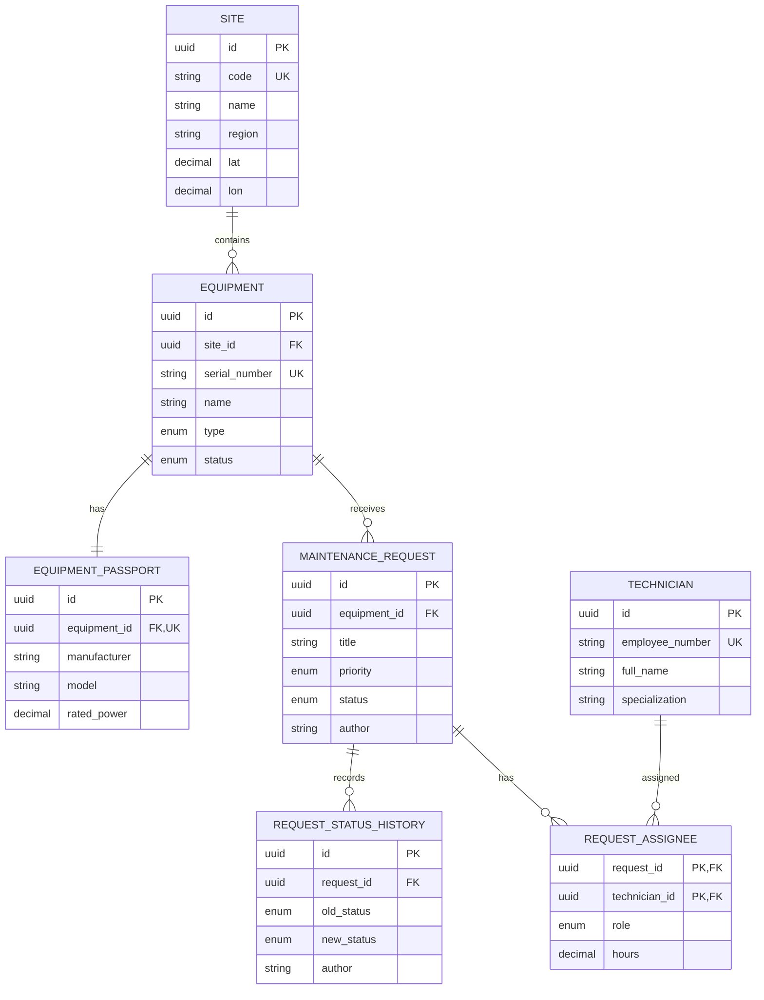

# CaseLab JavaScript / Full-Stack

Учебный Node.js-проект: погодная CLI-утилита и REST API для учёта оборудования и заявок на обслуживание. Текущая версия API использует PostgreSQL, Sequelize migrations, транзакции и SQL-отчёты.

## Cases

- **Case 1 — Weather CLI.** Получает прогноз Open-Meteo для нескольких городов, выводит таблицу, сохраняет JSON-отчёты и использует их как кэш.
- **Case 2 — Maintenance REST API.** Добавляет Express API для оборудования, заявок и прогноза условий наружных работ.
- **Case 3 — PostgreSQL and analytics.** Сохраняет API Case 2, переносит runtime storage в PostgreSQL и добавляет связи, assignees, историю статусов и отчёты.

## Stack

- Node.js 20+ и ESM;
- Express 5 и Zod;
- PostgreSQL 16;
- Sequelize 6 и sequelize-cli;
- Docker Compose;
- Pino, Helmet, CORS и express-rate-limit;
- Open-Meteo API;
- ESLint и Prettier;
- Postman/Newman.

## Quick Start

Требуются Node.js 20+, npm, Docker Engine или Docker Desktop и Docker Compose.

```bash
git clone https://github.com/SmokyRM/caselab-js.git
cd caselab-js
npm ci
cp .env.example .env
```

Укажите локальный пароль PostgreSQL в `.env`:

```dotenv
DB_PASSWORD=your_local_password
```

Запустите БД, дождитесь состояния `healthy`, примените migrations и seeds:

```bash
npm run db:up
docker compose ps
npm run db:migrate
npm run db:seed
npm start
```

Проверка API:

```http
GET http://localhost:3000/api/health
```

```json
{
  "status": "ok"
}
```

Weather CLI запускается отдельно:

```bash
npm run weather -- --city "Москва,Казань" --days 3
npm run weather -- --city Москва --days 1 --no-cache
```

Параметр `--city` обязателен, `--days` принимает значения от 1 до 7, а `--no-cache` пропускает чтение сегодняшнего отчёта.

## Architecture

HTTP-запрос проходит через слои:

```text
routes
  → validation middleware
  → controllers
  → services
  → repositories
  → Sequelize / raw SQL
  → PostgreSQL
```

- Routes связывают URL с validation middleware и controller.
- Controllers формируют HTTP response.
- Services содержат бизнес-правила и транзакции.
- Repositories выполняют DB queries.
- Models задают Sequelize mappings и associations.
- Migrations управляют схемой, seeders добавляют demo data.
- Analytics repository использует параметризованный raw SQL.

Основные каталоги:

```text
database/
├── migrations/
├── seeders/
├── config.cjs
└── seed-ids.cjs
docs/postman/
src/
├── api/
├── controllers/
├── db/
│   ├── models/
│   ├── database.js
│   └── sequelize.js
├── errors/
├── middlewares/
├── repositories/
├── routes/
├── services/
├── validators/
├── app.js
├── config.js
└── server.js
docker-compose.yml
.sequelizerc
```

## Database

### ER Diagram



### Relations and constraints

- Site → Equipment: 1:N.
- Equipment → EquipmentPassport: 1:1.
- Equipment → MaintenanceRequest: 1:N.
- MaintenanceRequest → RequestStatusHistory: 1:N.
- MaintenanceRequest ↔ Technician: N:M через RequestAssignee.

Схема следует 3NF: site, passport, technician и status history хранятся отдельно. N:M вынесена в `request_assignees`, где находятся атрибуты связи `role` и `hours`.

Основные ограничения:

- `equipment.serial_number` и `technicians.employee_number` — `UNIQUE`;
- `equipment_passports.equipment_id` — `UNIQUE`;
- primary key `request_assignees` состоит из `request_id` и `technician_id`;
- `request_assignees.hours > 0`;
- latitude и longitude ограничены допустимыми диапазонами;
- обязательные поля имеют `NOT NULL`;
- типы, статусы, priorities и roles представлены PostgreSQL ENUM.

Правила удаления:

| Связь                                     | `ON DELETE` |
| ----------------------------------------- | ----------- |
| Site → Equipment                          | `RESTRICT`  |
| Equipment → EquipmentPassport             | `CASCADE`   |
| Equipment → MaintenanceRequest            | `RESTRICT`  |
| MaintenanceRequest → RequestAssignee      | `CASCADE`   |
| Technician → RequestAssignee              | `RESTRICT`  |
| MaintenanceRequest → RequestStatusHistory | `CASCADE`   |

### Migrations and seeds

Схема создаётся только migrations; `sequelize.sync()` не используется. Порядок:

1. sites;
2. equipment;
3. equipment passports;
4. maintenance requests;
5. technicians;
6. request assignees;
7. request status history.

Откат последней или всех migrations:

```bash
npm run db:migrate:undo
npm run db:migrate:undo:all
```

Чистый цикл для development/demo database:

```bash
npm run db:migrate:undo:all
npm run db:migrate
npm run db:seed
```

Команда удаляет текущие данные development/demo database. `db:seed:undo:all` удаляет только seeded rows и может встретить FK conflict при наличии связанных runtime data.

Seed baseline:

| Entity               | Count |
| -------------------- | ----: |
| Sites                |     2 |
| Equipment            |     6 |
| Equipment passports  |     6 |
| Technicians          |     5 |
| Maintenance requests |    20 |
| Request assignees    |    18 |
| Status history rows  |    43 |

Повторный `db:seed` поверх заполненной БД не рассчитан на идемпотентный запуск.

## API

Все endpoints используют prefix `/api`. List endpoints выполняют filtering, sorting and pagination в PostgreSQL через `WHERE`, `ORDER BY`, `LIMIT` и `OFFSET`.

### Equipment

| Method | Endpoint                  | Description                          |
| ------ | ------------------------- | ------------------------------------ |
| GET    | `/equipment`              | Список оборудования                  |
| POST   | `/equipment`              | Создать equipment                    |
| GET    | `/equipment/:id`          | Equipment и passport                 |
| PATCH  | `/equipment/:id`          | Частично изменить equipment          |
| DELETE | `/equipment/:id`          | Удалить equipment без requests       |
| GET    | `/equipment/:id/requests` | Requests выбранного equipment        |
| GET    | `/equipment/:id/weather`  | Прогноз и пригодность наружных работ |

Equipment list поддерживает filters `status`, `type`, `installedFrom`, `installedTo`, сортировку, `page` и `limit`.

### Maintenance Requests

| Method | Endpoint               | Description                       |
| ------ | ---------------------- | --------------------------------- |
| GET    | `/requests`            | Список requests                   |
| POST   | `/requests`            | Создать request со статусом `new` |
| GET    | `/requests/:id`        | Request с assignees               |
| PATCH  | `/requests/:id`        | Изменить поля request             |
| PATCH  | `/requests/:id/status` | Изменить статус                   |
| DELETE | `/requests/:id`        | Удалить request                   |

Request list поддерживает filters `status`, `priority`, `equipmentId`, `createdFrom`, `createdTo`, сортировку, `page` и `limit`.

### Week 3 endpoints

| Method | Endpoint                          | Description                    |
| ------ | --------------------------------- | ------------------------------ |
| POST   | `/requests/:id/assignees`         | Полностью заменить команду     |
| DELETE | `/requests/:id/assignees/:userId` | Удалить assignee               |
| GET    | `/requests/:id/history`           | История статусов               |
| GET    | `/sites/:id/summary`              | Сводка requests площадки       |
| GET    | `/reports/equipment-load`         | Агрегированный отчёт equipment |

### Business rules

Допустимые переходы статусов:

- `new` → `in_progress`;
- `new` → `rejected`;
- `in_progress` → `done`;
- `in_progress` → `rejected`.

`done` и `rejected` — terminal statuses. Переход `new → in_progress` требует хотя бы одного assignee; иначе возвращается `409 REQUEST_REQUIRES_ASSIGNEES`.

Команда request содержит минимум одного специалиста и ровно одного `lead`. Technician не может повторяться, а `hours` должны быть больше нуля. Удалить lead при оставшихся members нельзя. Единственного lead можно удалить, оставив команду пустой.

Удаление equipment с открытыми requests блокируется как `409 EQUIPMENT_HAS_OPEN_REQUESTS`. FK `Equipment → MaintenanceRequest` использует `RESTRICT`, поэтому любые связанные requests блокируют физическое удаление. Такой DB conflict возвращается как `409 EQUIPMENT_HAS_REQUESTS`.

Weather endpoint принимает `days` от 1 до 7. Пригодность наружных работ рассчитывается по лимитам осадков и скорости ветра из environment.

Контролируемые ошибки имеют единый формат:

```json
{
  "error": {
    "code": "VALIDATION_ERROR",
    "message": "Переданы некорректные данные.",
    "details": [],
    "requestId": "uuid"
  }
}
```

Основные Week 3 codes: `SITE_NOT_FOUND`, `TECHNICIAN_NOT_FOUND`, `REQUEST_ASSIGNEE_NOT_FOUND`, `REQUEST_ASSIGNEE_CONFLICT`, `REQUEST_REQUIRES_ASSIGNEES`, `REQUEST_TEAM_REQUIRES_LEAD`, `EQUIPMENT_HAS_REQUESTS`, `INVALID_PAGINATION`.

## Transactions

Смена статуса выполняется в одной транзакции:

```text
BEGIN
SELECT request FOR UPDATE
validate transition
check assignees for in_progress
UPDATE request
INSERT status history
COMMIT
```

Статус и history изменяются атомарно. `FOR UPDATE` блокирует конкурирующие изменения одной request row. При ошибке транзакция откатывается.

`POST /requests/:id/assignees` полностью заменяет команду:

```text
BEGIN
SELECT request FOR UPDATE
validate technicians
DELETE old assignments
INSERT new assignments
SELECT resulting team
COMMIT
```

Если technician не найден или вставка завершается ошибкой, выполняется rollback и прежняя команда сохраняется.

Status history доступна через `GET /requests/:id/history`. API не предоставляет операций изменения или удаления history rows.

## Analytics

### Site summary

`GET /sites/:id/summary` возвращает site metadata, общее число requests, counts по status и priority, а также `averageCloseHours`. Время закрытия берётся из первой history transition в `done` или `rejected`.

### Equipment load

`GET /reports/equipment-load` возвращает:

- `equipmentId`;
- `equipmentName`;
- `serialNumber`;
- `requestCount`;
- `closedRequestCount`;
- `totalPlannedHours`;
- `lastMaintenanceAt`.

Query parameters:

| Parameter     | Default | Bounds                 |
| ------------- | ------- | ---------------------- |
| `from`        | —       | date или ISO date-time |
| `to`          | —       | date или ISO date-time |
| `minRequests` | `0`     | integer ≥ 0            |
| `limit`       | `50`    | 1–100                  |
| `offset`      | `0`     | 0–10000                |

Raw SQL использует CTE `filtered_requests`, `request_labor` и `request_done_times`, затем `GROUP BY`, aggregates и `HAVING`. `request_labor` агрегирует hours до JOIN с history, чтобы не дублировать трудозатраты.

`closedRequestCount` включает `done` и `rejected`. `lastMaintenanceAt` учитывает только первую transition в `done`. `minRequests` применяется через `HAVING COUNT(...)`.

Параметры отчётов передаются в SQL через bind parameters. Пользовательские значения не конкатенируются со строкой запроса. Сортировка equipment-load статична; sort fields обычных списков проходят whitelist validation.

## Compatibility notes

Case 2 API принимает и возвращает `location: { lat, lon }`. В Week 3 координаты хранятся в Site. Equipment repository загружает location через association и при записи ищет site по координатам. Если site отсутствует, создаётся compatibility site.

Поле `maintenance_requests.author` обязательно в БД. Старый POST body не содержит author, поэтому repository записывает внутреннее значение `api`.

Связанные Site, passport и assignees загружаются через Sequelize `include`.

Sequelize instance создаётся один раз. Перед запуском HTTP server выполняется `sequelize.authenticate()`. Если БД недоступна, HTTP server не запускается. При `SIGINT` или `SIGTERM` закрываются HTTP server и connection pool.

## Environment

Локальный `.env` не коммитится. `.env.example` содержит defaults и безопасный placeholder для `DB_PASSWORD`. `npm start` читает `.env` через встроенный `--env-file-if-exists` Node.js.

### API and Weather

| Variable                    | Default / example        | Description                      |
| --------------------------- | ------------------------ | -------------------------------- |
| `PORT`                      | `3000`                   | Express port                     |
| `NODE_ENV`                  | `development`            | Runtime environment name         |
| `GEOCODING_API_URL`         | Open-Meteo geocoding URL | Weather CLI geocoding            |
| `FORECAST_API_URL`          | Open-Meteo forecast URL  | Weather forecast                 |
| `REQUEST_TIMEOUT_MS`        | `5000`                   | Open-Meteo timeout, ms           |
| `REPORTS_DIR`               | `reports`                | Weather reports/cache directory  |
| `TEMPERATURE_UNIT`          | `celsius`                | `celsius` or `fahrenheit`        |
| `PRECIPITATION_UNIT`        | `mm`                     | `mm` or `inch`                   |
| `OUTDOOR_MAX_PRECIPITATION` | `0`                      | Outdoor work precipitation limit |
| `OUTDOOR_MAX_WIND_SPEED`    | `36`                     | Outdoor work wind limit          |
| `CORS_ORIGINS`              | local origins            | Comma-separated allowlist        |
| `RATE_LIMIT_WINDOW_MS`      | `60000`                  | Rate-limit window, ms            |
| `RATE_LIMIT_MAX`            | `100`                    | Requests per window              |
| `LOG_LEVEL`                 | `info`                   | Pino log level                   |

### Database

| Variable             | Default / example | Description                         |
| -------------------- | ----------------- | ----------------------------------- |
| `DB_HOST`            | `localhost`       | PostgreSQL host                     |
| `DB_PORT`            | `5432`            | PostgreSQL port                     |
| `DB_NAME`            | `caselab`         | Database name                       |
| `DB_USER`            | `caselab`         | Database user                       |
| `DB_PASSWORD`        | `change_me`       | Required local password placeholder |
| `DB_POOL_MAX`        | `10`              | Maximum pool size                   |
| `DB_POOL_MIN`        | `0`               | Minimum pool size                   |
| `DB_POOL_ACQUIRE_MS` | `30000`           | Pool acquire timeout, ms            |
| `DB_POOL_IDLE_MS`    | `10000`           | Idle connection timeout, ms         |

## Postman

Collection:

```text
docs/postman/CaseLab Maintenance API.postman_collection.json
```

Environment:

```text
docs/postman/CaseLab Maintenance API.postman_environment.json
```

Collection содержит Week 2 и Week 3 scenarios, negative cases, analytics и cleanup.

Последний проверенный Newman run: **69 requests / 220 assertions / 0 failures**.

Rate-limit scenario запускается отдельно с `RATE_LIMIT_MAX=2`: ожидаются ответы `200`, `200`, `429`.

## Useful commands

| Command                                     | Description                  |
| ------------------------------------------- | ---------------------------- |
| `npm start`                                 | Start Express API            |
| `npm run weather -- --city Москва --days 3` | Run Weather CLI              |
| `npm run db:up`                             | Start PostgreSQL             |
| `npm run db:down`                           | Stop Compose services        |
| `npm run db:logs`                           | Show PostgreSQL logs         |
| `npm run db:migrate`                        | Apply migrations             |
| `npm run db:migrate:undo`                   | Roll back the last migration |
| `npm run db:migrate:undo:all`               | Roll back all migrations     |
| `npm run db:seed`                           | Apply seeders                |
| `npm run db:seed:undo:all`                  | Undo seeders                 |
| `npm run lint`                              | Run ESLint                   |
| `npm run format`                            | Format files with Prettier   |
| `npm run format:check`                      | Check formatting             |
