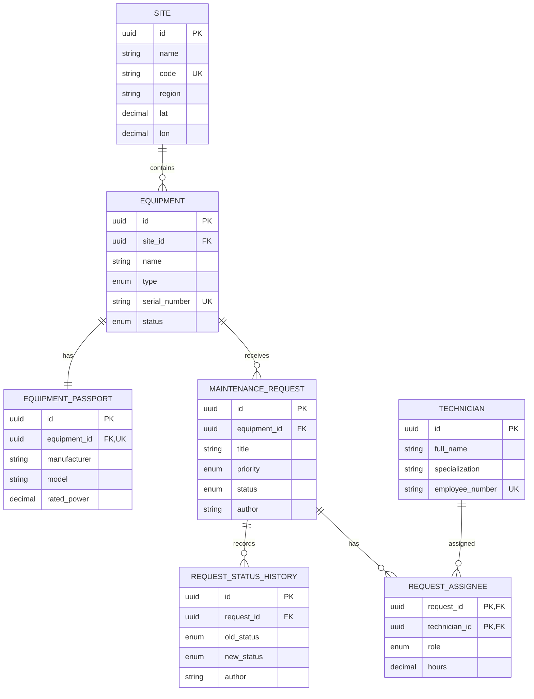

# CaseLab JavaScript / Full-Stack

Учебный репозиторий CaseLab с тремя последовательными этапами на современном JavaScript и Node.js.

## Cases

- **Case 1 — Weather CLI:** консольная утилита для получения, форматирования и кэширования прогноза Open-Meteo.
- **Case 2 — Maintenance REST API:** Express API для оборудования, заявок на обслуживание и проверки погодных условий для наружных работ.
- **Case 3 — PostgreSQL, транзакции и аналитика:** API Case 2 сохраняет внешний контракт, но runtime-хранилище переносится в PostgreSQL, доменная модель расширяется связями, историей статусов и аналитическими отчётами.

## Требования

- Node.js 20 или новее;
- npm;
- Docker Desktop или Docker Engine;
- Docker Compose.

PostgreSQL отдельно устанавливать не нужно: development-база запускается через Docker Compose.

HTTP-запросы к Open-Meteo выполняются встроенной функцией `fetch`. API key не требуется.

## Быстрый запуск с нуля

```bash
git clone https://github.com/SmokyRM/caselab-js.git
cd caselab-js
npm ci
cp .env.example .env
```

В локальном `.env` обязательно замените безопасный placeholder на собственный пароль development-базы:

```dotenv
DB_PASSWORD=your_local_password
```

Запустите PostgreSQL, дождитесь состояния `healthy`, примените миграции и заполните demo data:

```bash
npm run db:up
docker compose ps
npm run db:migrate
npm run db:seed
npm start
```

Проверка запущенного API:

```http
GET http://localhost:3000/api/health
```

Ожидаемый ответ: `200 {"status":"ok"}`. Команда `npm ci` устанавливает версии зависимостей из `package-lock.json`. Файл `.env` локальный и не коммитится.

# Case 1 — Weather CLI

Консольная Node.js-утилита получает прогноз погоды через Open-Meteo для одного или нескольких городов.

Основные возможности:

- поиск координат города через Open-Meteo Geocoding API;
- получение прогноза погоды на срок от 1 до 7 дней;
- параллельная обработка нескольких городов через `Promise.allSettled`;
- читаемый табличный вывод в консоль;
- сохранение успешных результатов в JSON;
- использование подходящего отчёта за текущий день как кэша;
- принудительное обновление данных с флагом `--no-cache`;
- обработка ошибок аргументов, HTTP, сети, JSON и превышения времени ожидания;
- настройка API, тайм-аута, каталога отчётов и единиц измерения через переменные окружения.

## Запуск Weather CLI

Прогноз для одного города:

```bash
npm run weather -- --city Москва --days 3
```

Прогноз для нескольких городов:

```bash
npm run weather -- --city "Москва,Казань" --days 3
```

Принудительное получение свежих данных без чтения кэша:

```bash
npm run weather -- --city Москва --days 3 --no-cache
```

## CLI-параметры

| Параметр     | Обязательный | Описание                                                |
| ------------ | ------------ | ------------------------------------------------------- |
| `--city`     | Да           | Город или список городов через запятую.                 |
| `--days`     | Нет          | Количество дней прогноза от 1 до 7. По умолчанию — `3`. |
| `--no-cache` | Нет          | Игнорирует сегодняшний кэш и выполняет новый запрос.    |

Примеры:

```bash
npm run weather -- --city "Нижний Новгород"
npm run weather -- --city "Москва,Казань,Нижний Новгород" --days 5
npm run weather -- --city Москва --days 1 --no-cache
```

## Переменные окружения Weather CLI

| Переменная           | Значение по умолчанию                            | Назначение                                               |
| -------------------- | ------------------------------------------------ | -------------------------------------------------------- |
| `GEOCODING_API_URL`  | `https://geocoding-api.open-meteo.com/v1/search` | URL API поиска координат города.                         |
| `FORECAST_API_URL`   | `https://api.open-meteo.com/v1/forecast`         | URL API прогноза погоды.                                 |
| `REQUEST_TIMEOUT_MS` | `5000`                                           | Максимальное время ожидания HTTP-ответа в миллисекундах. |
| `REPORTS_DIR`        | `reports`                                        | Каталог для отчётов и кэша.                              |
| `TEMPERATURE_UNIT`   | `celsius`                                        | Единица температуры: `celsius` или `fahrenheit`.         |
| `PRECIPITATION_UNIT` | `mm`                                             | Единица осадков: `mm` или `inch`.                        |

Обычный npm script не читает файл `.env` автоматически, потому что пакет `dotenv` не используется. Переменную можно передать для одного запуска:

```bash
TEMPERATURE_UNIT=fahrenheit npm run weather -- --city Москва --days 1 --no-cache
```

Либо можно создать `.env` из примера и использовать встроенный параметр Node.js:

```bash
cp .env.example .env
node --env-file=.env src/index.js --city Москва --days 3
```

Файл `.env` предназначен для локальных настроек и не коммитится.

## Пример вывода CLI

```text
Москва, Россия
Координаты: 55.75204, 37.61781

Дата         Мин.       Макс.      Осадки
2026-09-11   11.6 °C    17.6 °C    8.2 мм
Отчёт сохранён: reports/Москва-2026-09-11.json
```

## Кэш и отчёты

По умолчанию успешные результаты сохраняются в каталоге `reports/`:

```text
reports/{город}-{YYYY-MM-DD}.json
```

Подходящий отчёт за текущий день используется как кэш. Город и дата определяются именем файла, а объект `cacheInfo` внутри JSON хранит:

- `days`;
- `temperatureUnit`;
- `precipitationUnit`.

Если `cacheInfo` отсутствует или его параметры не совпадают с текущим запросом, файл считается cache miss и приложение обращается к Open-Meteo. Флаг `--no-cache` всегда пропускает чтение существующего кэша.

Каталог `reports/` добавлен в `.gitignore` и не попадает в репозиторий.

## Ошибки и exit codes CLI

CLI обрабатывает следующие случаи:

- отсутствует обязательный параметр `--city`;
- значение `--days` не является целым числом от 1 до 7;
- передан неизвестный аргумент;
- город не найден;
- Open-Meteo вернул HTTP 4xx или HTTP 5xx;
- произошла сетевая ошибка;
- превышено время ожидания ответа;
- API вернул некорректный JSON;
- JSON-файл кэша повреждён.

Города обрабатываются через `Promise.allSettled`, поэтому ошибка одного города не останавливает получение и вывод данных для остальных.

- `0` — все запрошенные города обработаны успешно;
- `1` — произошла ошибка аргументов или хотя бы один город завершился ошибкой.

## Как работает Weather CLI

```text
CLI
 ↓
проверка кэша
 ├─ cache hit  → готовые данные без обращения к API
 └─ cache miss → Geocoding API → Forecast API → готовые данные
 ↓
JSON report
 ↓
вывод в консоль
```

Запросы разных городов запускаются параллельно. Внутри обработки одного города геокодинг и запрос прогноза выполняются последовательно, потому что для прогноза сначала нужны координаты.

Основные модули Weather CLI:

- `src/index.js` — точка входа, запуск CLI, вывод результатов и установка exit code;
- `src/config.js` — чтение, проверка и значения по умолчанию для переменных окружения;
- `src/cli/arguments.js` — разбор и валидация аргументов командной строки;
- `src/api/openMeteo.js` — HTTP-запросы геокодинга и прогноза к Open-Meteo;
- `src/services/weatherService.js` — проверка кэша и обработка одного или нескольких городов;
- `src/storage/reportStorage.js` — чтение и сохранение JSON-отчётов;
- `src/format/consoleFormatter.js` — преобразование прогноза в строку для консоли.

## Postman Case 1

Коллекция находится по пути:

```text
docs/postman/CaseLab Weather Digest.postman_collection.json
```

Postman Collection v2.1 содержит запросы Geocoding и Forecast, переменные коллекции, а также сохранённые примеры успешных ответов, города без результата и HTTP 400 для некорректных параметров.

# Case 2 — Maintenance REST API

REST API предназначен для учёта оборудования, заявок на техническое обслуживание, состояния заявок и погодных условий для наружных работ.

В Week 2 этот API был реализован с in-memory repositories. В текущей версии Week 3 внешний HTTP-контракт сохранён, а repositories работают с PostgreSQL через Sequelize. Данные больше не теряются при перезапуске Node.js-процесса.

## Запуск REST API

```bash
npm start
```

По умолчанию сервер доступен по адресу `http://localhost:3000`.

Проверка состояния:

```http
GET http://localhost:3000/api/health
```

Успешный ответ:

```json
{
  "status": "ok"
}
```

Case 1 при этом остаётся доступен отдельной командой:

```bash
npm run weather -- --city Москва --days 3
```

## Переменные окружения

Все поддерживаемые переменные перечислены в `.env.example` и обрабатываются в `src/config.js`.

| Variable                    | Description                                          | Default / Example                                |
| --------------------------- | ---------------------------------------------------- | ------------------------------------------------ |
| `PORT`                      | Порт Express API.                                    | `3000`                                           |
| `NODE_ENV`                  | Название окружения, отображаемое при старте сервера. | `development`                                    |
| `GEOCODING_API_URL`         | URL геокодинга Open-Meteo для Case 1.                | `https://geocoding-api.open-meteo.com/v1/search` |
| `FORECAST_API_URL`          | URL прогноза Open-Meteo для обоих кейсов.            | `https://api.open-meteo.com/v1/forecast`         |
| `REQUEST_TIMEOUT_MS`        | Timeout запросов к Open-Meteo, мс.                   | `5000`                                           |
| `REPORTS_DIR`               | Каталог отчётов и кэша Weather CLI.                  | `reports`                                        |
| `TEMPERATURE_UNIT`          | Единица температуры: `celsius` или `fahrenheit`.     | `celsius`                                        |
| `PRECIPITATION_UNIT`        | Единица осадков Weather CLI: `mm` или `inch`.        | `mm`                                             |
| `OUTDOOR_MAX_PRECIPITATION` | Максимальные осадки для наружных работ.              | `0` мм                                           |
| `OUTDOOR_MAX_WIND_SPEED`    | Максимальная скорость ветра для наружных работ.      | `36` км/ч                                        |
| `CORS_ORIGINS`              | Разрешённые Origin через запятую.                    | `http://localhost:3000,http://localhost:5173`    |
| `RATE_LIMIT_WINDOW_MS`      | Размер окна rate limit, мс.                          | `60000`                                          |
| `RATE_LIMIT_MAX`            | Максимум запросов к `/api` в одном окне.             | `100`                                            |
| `LOG_LEVEL`                 | Уровень логирования Pino.                            | `info`                                           |
| `DB_HOST`                   | Хост PostgreSQL.                                     | `localhost`                                      |
| `DB_PORT`                   | Порт PostgreSQL.                                     | `5432`                                           |
| `DB_NAME`                   | Имя базы данных.                                     | `caselab`                                        |
| `DB_USER`                   | Пользователь PostgreSQL.                             | `caselab`                                        |
| `DB_PASSWORD`               | Пароль PostgreSQL; обязателен для API и Compose.     | безопасный placeholder в `.env.example`          |
| `DB_POOL_MAX`               | Максимум соединений в pool Sequelize.                | `10`                                             |
| `DB_POOL_MIN`               | Минимум соединений в pool Sequelize.                 | `0`                                              |
| `DB_POOL_ACQUIRE_MS`        | Время ожидания соединения из pool, мс.               | `30000`                                          |
| `DB_POOL_IDLE_MS`           | Время простоя соединения перед освобождением, мс.    | `10000`                                          |

Команда `npm start` использует встроенный параметр Node.js `--env-file-if-exists=.env`, поэтому локальный `.env` подхватывается автоматически. Пакет `dotenv` не требуется. Эквивалентный прямой запуск:

```bash
cp .env.example .env
node --env-file=.env src/server.js
```

Для одной переменной достаточно shell-синтаксиса:

```bash
PORT=4000 npm start
```

Credentials передаются только через environment. Локальный `.env` не добавляется в Git, а `.env.example` содержит только безопасные defaults и placeholder. Docker Compose и Sequelize используют одни и те же `DB_*` параметры.

## Архитектура

Основной путь HTTP-запроса:

```text
routes
  → validation middleware
  → controllers
  → services
  → repositories
  → Sequelize / raw SQL
  → PostgreSQL
```

- **Routes** связывают HTTP method и URL с middleware и controller.
- **Controllers** получают проверенные данные запроса и формируют HTTP response.
- **Services** содержат бизнес-правила, координируют операции и управляют транзакциями.
- **Repositories** выполняют запросы к PostgreSQL через Sequelize или параметризованный raw SQL.
- **Models** задают Sequelize mappings и associations.
- **Migrations** последовательно создают и откатывают схему.
- **Seeders** добавляют согласованные demo data.
- **Analytics repository** содержит raw SQL для агрегированных отчётов.
- **Validators** описывают Zod-схемы для body, params и query.
- **Middlewares** реализуют общие HTTP-задачи: request ID, logging, Helmet, CORS, rate limit, JSON parsing, validation и обработку ошибок.
- **Errors** задают типы ошибок приложения, HTTP statuses и стабильные error codes.

## Структура проекта

```text
database/
├── migrations/            # семь миграций схемы Week 3
├── seeders/               # demo data
├── config.cjs             # sequelize-cli config
└── seed-ids.cjs           # deterministic UUID для seeds/Postman
docs/
└── postman/
    ├── CaseLab Maintenance API.postman_collection.json
    ├── CaseLab Maintenance API.postman_environment.json
    └── CaseLab Weather Digest.postman_collection.json
src/
├── api/
│   └── openMeteo.js
├── cli/
│   └── arguments.js
├── controllers/
│   ├── analytics.controller.js
│   ├── equipment.controller.js
│   ├── equipmentWeather.controller.js
│   └── request.controller.js
├── db/
│   ├── models/
│   ├── database.js
│   └── sequelize.js
├── errors/
├── format/
│   └── consoleFormatter.js
├── middlewares/
├── repositories/
│   ├── analytics.repository.js
│   ├── equipment.repository.js
│   └── request.repository.js
├── routes/
│   ├── analytics.routes.js
│   ├── equipment.routes.js
│   ├── health.routes.js
│   └── request.routes.js
├── services/
│   ├── analytics.service.js
│   ├── equipment.service.js
│   ├── equipmentWeather.service.js
│   ├── request.service.js
│   └── weatherService.js
├── storage/
│   └── reportStorage.js
├── validators/
├── app.js
├── config.js
├── index.js
├── logger.js
└── server.js
.sequelizerc
.env.example
docker-compose.yml
package.json
README.md
```

## Equipment model

| Поле           | Описание                                                           |
| -------------- | ------------------------------------------------------------------ |
| `id`           | UUID, генерируется сервером.                                       |
| `name`         | Название длиной от 3 до 100 символов.                              |
| `type`         | Тип оборудования.                                                  |
| `serialNumber` | Непустой уникальный серийный номер.                                |
| `location`     | Координаты `{ lat, lon }`: lat от -90 до 90, lon от -180 до 180.   |
| `status`       | Текущее состояние оборудования.                                    |
| `installedAt`  | Реальная дата `YYYY-MM-DD`, которая не может находиться в будущем. |

Допустимые значения `type`: `turbine`, `inverter`, `sensor`, `substation`.

Допустимые значения `status`: `operational`, `maintenance`, `fault`, `decommissioned`.

`serialNumber` должен быть уникальным. Попытка создать или обновить оборудование с уже существующим серийным номером возвращает `409 Conflict` с кодом `EQUIPMENT_SERIAL_CONFLICT`.

## Maintenance Request model

| Поле          | Описание                                             |
| ------------- | ---------------------------------------------------- |
| `id`          | UUID, генерируется сервером.                         |
| `equipmentId` | UUID существующего оборудования.                     |
| `title`       | Название заявки длиной от 5 до 120 символов.         |
| `description` | Необязательное описание длиной до 2000 символов.     |
| `priority`    | Приоритет заявки.                                    |
| `status`      | При создании сервер устанавливает `new`.             |
| `plannedAt`   | Необязательная дата и время в формате ISO date-time. |
| `createdAt`   | ISO date-time, генерируется сервером.                |
| `updatedAt`   | ISO date-time, генерируется и обновляется сервером.  |

Допустимые значения `priority`: `low`, `medium`, `high`, `critical`.

Допустимые значения `status`: `new`, `in_progress`, `done`, `rejected`.

`equipmentId` должен ссылаться на существующее оборудование. Если оборудование не найдено, создание или перенос заявки возвращает `404 Not Found` с кодом `EQUIPMENT_NOT_FOUND`.

## Переходы статусов заявок

```text
new
├──> in_progress
│      ├──> done
│      └──> rejected
└──> rejected
```

Разрешены только следующие переходы:

- `new` → `in_progress`;
- `new` → `rejected`;
- `in_progress` → `done`;
- `in_progress` → `rejected`.

Переход `new` → `in_progress` дополнительно требует хотя бы одного назначенного специалиста. Без команды API возвращает `409 REQUEST_REQUIRES_ASSIGNEES`.

Запрещены:

- `new` → `done`;
- любые переходы из `done`;
- любые переходы из `rejected`;
- повторная установка текущего статуса.

Любой недопустимый переход возвращает `409 Conflict` с кодом `INVALID_REQUEST_STATUS_TRANSITION`.

Статус изменяется только через отдельный endpoint, а не через обычный PATCH заявки:

```http
PATCH /api/requests/:id/status
```

```json
{
  "status": "in_progress"
}
```

## API endpoints

### Health

| Method | Endpoint      | Description                 | Success status |
| ------ | ------------- | --------------------------- | -------------- |
| GET    | `/api/health` | Проверить состояние сервиса | `200`          |

### Equipment

| Method | Endpoint                      | Description                             | Success status |
| ------ | ----------------------------- | --------------------------------------- | -------------- |
| GET    | `/api/equipment`              | Получить список оборудования            | `200`          |
| POST   | `/api/equipment`              | Создать оборудование                    | `201`          |
| GET    | `/api/equipment/:id`          | Получить оборудование по UUID           | `200`          |
| PATCH  | `/api/equipment/:id`          | Частично изменить оборудование          | `200`          |
| DELETE | `/api/equipment/:id`          | Удалить оборудование                    | `204`          |
| GET    | `/api/equipment/:id/requests` | Получить заявки выбранного оборудования | `200`          |
| GET    | `/api/equipment/:id/weather`  | Получить прогноз для оборудования       | `200`          |

### Maintenance Requests

| Method | Endpoint                   | Description                          | Success status |
| ------ | -------------------------- | ------------------------------------ | -------------- |
| GET    | `/api/requests`            | Получить список заявок               | `200`          |
| POST   | `/api/requests`            | Создать заявку                       | `201`          |
| GET    | `/api/requests/:id`        | Получить заявку по UUID              | `200`          |
| PATCH  | `/api/requests/:id`        | Частично изменить поля заявки        | `200`          |
| PATCH  | `/api/requests/:id/status` | Выполнить допустимый переход статуса | `200`          |
| DELETE | `/api/requests/:id`        | Удалить заявку                       | `204`          |

### Week 3 endpoints

| Method | Endpoint                              | Назначение                                 | Success status |
| ------ | ------------------------------------- | ------------------------------------------ | -------------- |
| POST   | `/api/requests/:id/assignees`         | Полностью заменить команду заявки          | `200`          |
| DELETE | `/api/requests/:id/assignees/:userId` | Удалить назначенного специалиста           | `204`          |
| GET    | `/api/requests/:id/history`           | Получить историю переходов статуса         | `200`          |
| GET    | `/api/sites/:id/summary`              | Получить сводку заявок площадки            | `200`          |
| GET    | `/api/reports/equipment-load`         | Получить агрегированный отчёт оборудования | `200`          |

## Фильтрация, сортировка и пагинация

### Equipment query parameters

| Параметр        | Значения / формат                                       | Default |
| --------------- | ------------------------------------------------------- | ------- |
| `status`        | `operational`, `maintenance`, `fault`, `decommissioned` | —       |
| `type`          | `turbine`, `inverter`, `sensor`, `substation`           | —       |
| `installedFrom` | Дата `YYYY-MM-DD` включительно                          | —       |
| `installedTo`   | Дата `YYYY-MM-DD` включительно                          | —       |
| `sortBy`        | `name`, `type`, `serialNumber`, `status`, `installedAt` | `name`  |
| `sortOrder`     | `asc`, `desc`                                           | `asc`   |
| `page`          | Целое число от 1                                        | `1`     |
| `limit`         | Целое число от 1 до 100                                 | `10`    |

```http
GET /api/equipment?type=turbine&status=operational&page=1&limit=10
```

### Request query parameters

Параметры применяются к `/api/requests` и `/api/equipment/:id/requests`.

| Параметр      | Значения / формат                                                    | Default     |
| ------------- | -------------------------------------------------------------------- | ----------- |
| `status`      | `new`, `in_progress`, `done`, `rejected`                             | —           |
| `priority`    | `low`, `medium`, `high`, `critical`                                  | —           |
| `equipmentId` | UUID оборудования                                                    | —           |
| `createdFrom` | `YYYY-MM-DD` или ISO date-time                                       | —           |
| `createdTo`   | `YYYY-MM-DD` или ISO date-time                                       | —           |
| `sortBy`      | `title`, `priority`, `status`, `plannedAt`, `createdAt`, `updatedAt` | `createdAt` |
| `sortOrder`   | `asc`, `desc`                                                        | `desc`      |
| `page`        | Целое число от 1                                                     | `1`         |
| `limit`       | Целое число от 1 до 100                                              | `10`        |

```http
GET /api/requests?priority=high&status=new&sortBy=createdAt&sortOrder=desc
```

Оба списка возвращают единый paginated response: элементы находятся в `data`, а общее количество и текущие параметры пагинации — в `meta`.

```json
{
  "data": [],
  "meta": {
    "total": 0,
    "page": 1,
    "limit": 10
  }
}
```

## Создание оборудования

```http
POST /api/equipment
Content-Type: application/json
```

```json
{
  "name": "Турбина №1",
  "type": "turbine",
  "serialNumber": "WT-2026-001",
  "location": {
    "lat": 55.75,
    "lon": 37.61
  },
  "status": "operational",
  "installedAt": "2024-05-20"
}
```

Ответ `201 Created` содержит созданный объект и header `Location: /api/equipment/<id>`:

```json
{
  "data": {
    "id": "aaaaaaaa-aaaa-4aaa-8aaa-aaaaaaaaaaaa",
    "name": "Турбина №1",
    "type": "turbine",
    "serialNumber": "WT-2026-001",
    "location": {
      "lat": 55.75,
      "lon": 37.61
    },
    "status": "operational",
    "installedAt": "2024-05-20"
  }
}
```

## Создание заявки

`equipmentId` должен ссылаться на существующее оборудование.

```http
POST /api/requests
Content-Type: application/json
```

```json
{
  "equipmentId": "aaaaaaaa-aaaa-4aaa-8aaa-aaaaaaaaaaaa",
  "title": "Плановое обслуживание турбины",
  "description": "Проверить основные узлы",
  "priority": "high",
  "plannedAt": "2026-10-01T10:00:00.000Z"
}
```

Ответ `201 Created` получает header `Location: /api/requests/<id>`. Сервер добавляет `id`, начальный статус и timestamps:

```json
{
  "data": {
    "id": "bbbbbbbb-bbbb-4bbb-8bbb-bbbbbbbbbbbb",
    "equipmentId": "aaaaaaaa-aaaa-4aaa-8aaa-aaaaaaaaaaaa",
    "title": "Плановое обслуживание турбины",
    "description": "Проверить основные узлы",
    "priority": "high",
    "plannedAt": "2026-10-01T10:00:00.000Z",
    "status": "new",
    "createdAt": "2026-09-15T10:00:00.000Z",
    "updatedAt": "2026-09-15T10:00:00.000Z"
  }
}
```

## Правило удаления оборудования

`DELETE /api/equipment/:id` сначала проверяет открытые заявки со статусом `new` или `in_progress`. При их наличии API возвращает `409 EQUIPMENT_HAS_OPEN_REQUESTS`.

На уровне PostgreSQL связь `equipment → maintenance_requests` использует `ON DELETE RESTRICT`. Поэтому оборудование нельзя физически удалить и при наличии закрытых заявок. Такая ошибка FK преобразуется API в `409 EQUIPMENT_HAS_REQUESTS`. Удаление возможно только для оборудования без связанных заявок.

## Погода и пригодность наружных работ

```http
GET /api/equipment/:id/weather?days=3
```

`days` — целое число от 1 до 7, значение по умолчанию — `3`. Координаты берутся из `equipment.location`, поэтому отдельный геокодинг не требуется. Endpoint переиспользует Open-Meteo client из Case 1 и добавляет к прогнозу максимальную скорость ветра.

Сокращённый ответ:

```json
{
  "data": {
    "equipmentId": "aaaaaaaa-aaaa-4aaa-8aaa-aaaaaaaaaaaa",
    "location": {
      "lat": 55.75,
      "lon": 37.61
    },
    "rules": {
      "maxPrecipitation": 0,
      "maxWindSpeed": 36,
      "precipitationUnit": "mm",
      "windSpeedUnit": "km/h"
    },
    "outdoorWorkSuitable": true,
    "forecast": [
      {
        "date": "2026-09-15",
        "minTemperature": 8.4,
        "maxTemperature": 16.1,
        "precipitation": 0,
        "maxWindSpeed": 18.2,
        "suitableForOutdoorWork": true
      }
    ]
  }
}
```

Каждый день подходит для наружных работ, только если одновременно выполняются условия:

```text
precipitation <= OUTDOOR_MAX_PRECIPITATION
AND
maxWindSpeed <= OUTDOOR_MAX_WIND_SPEED
```

Поле `suitableForOutdoorWork` содержит результат для одного дня. `outdoorWorkSuitable` равно `true`, только если подходят **все** дни прогноза. Defaults: `0` мм осадков и `36` км/ч ветра.

Ошибка внешнего погодного API преобразуется в контролируемый ответ и не останавливает REST server:

- `502 WEATHER_API_ERROR` — Open-Meteo недоступен или вернул некорректный ответ;
- `504 WEATHER_API_TIMEOUT` — превышен `REQUEST_TIMEOUT_MS`.

## Формат ошибок

Все контролируемые ошибки возвращаются в едином формате:

```json
{
  "error": {
    "code": "VALIDATION_ERROR",
    "message": "Переданы некорректные данные.",
    "details": [],
    "requestId": "cccccccc-cccc-4ccc-8ccc-cccccccccccc"
  }
}
```

| HTTP status | Пример причины                                 | Реальные error codes                                                                                                                                                                 |
| ----------- | ---------------------------------------------- | ------------------------------------------------------------------------------------------------------------------------------------------------------------------------------------ |
| `400`       | JSON или пагинация некорректны                 | `INVALID_JSON`, `INVALID_PAGINATION`                                                                                                                                                 |
| `403`       | Origin запрещён CORS                           | `CORS_ORIGIN_DENIED`                                                                                                                                                                 |
| `404`       | Ресурс, назначение или маршрут не найден       | `EQUIPMENT_NOT_FOUND`, `REQUEST_NOT_FOUND`, `SITE_NOT_FOUND`, `TECHNICIAN_NOT_FOUND`, `REQUEST_ASSIGNEE_NOT_FOUND`, `ROUTE_NOT_FOUND`                                                |
| `409`       | Конфликт бизнес-правил                         | `EQUIPMENT_SERIAL_CONFLICT`, `EQUIPMENT_HAS_OPEN_REQUESTS`, `EQUIPMENT_HAS_REQUESTS`, `INVALID_REQUEST_STATUS_TRANSITION`, `REQUEST_ASSIGNEE_CONFLICT`, `REQUEST_REQUIRES_ASSIGNEES` |
| `413`       | JSON body больше 100kb                         | `PAYLOAD_TOO_LARGE`                                                                                                                                                                  |
| `422`       | Ошибка body, params, query или состава команды | `VALIDATION_ERROR`, `REQUEST_TEAM_REQUIRES_LEAD`                                                                                                                                     |
| `429`       | Превышен rate limit                            | `RATE_LIMIT_EXCEEDED`                                                                                                                                                                |
| `500`       | Непредвиденная внутренняя ошибка               | `INTERNAL_ERROR`                                                                                                                                                                     |
| `502`       | Ошибка внешнего погодного API                  | `WEATHER_API_ERROR`                                                                                                                                                                  |
| `504`       | Timeout внешнего погодного API                 | `WEATHER_API_TIMEOUT`                                                                                                                                                                |

## Request ID и logging

Каждый HTTP response получает header `X-Request-Id`. Если клиент прислал непустой `X-Request-Id`, сервер переиспользует его; иначе генерирует UUID. Тот же идентификатор присутствует в error JSON и структурированных логах.

Логирование выполняется через Pino. Для каждого завершённого HTTP request записываются:

- `requestId`;
- `method`;
- `path`;
- `status`;
- `durationMs`.

Уровни логирования:

- `info` — HTTP 2xx и 3xx;
- `warn` — HTTP 4xx;
- `error` — HTTP 5xx.

Тело запроса автоматически не логируется.

## Security

### CORS

Сервер использует явный allowlist из `CORS_ORIGINS`; wildcard `*` не применяется. Запросы без header `Origin` разрешены. Запрещённый Origin получает `403 CORS_ORIGIN_DENIED`.

### Rate limit

Rate limit действует на `/api` и настраивается через `RATE_LIMIT_WINDOW_MS` и `RATE_LIMIT_MAX`. При превышении лимита API возвращает `429 RATE_LIMIT_EXCEEDED` и стандартные `RateLimit` headers.

### Helmet

Helmet добавляет защитные HTTP headers ко всем ответам.

### Ограничение размера body

JSON body ограничен значением `100kb`. Превышение возвращает `413 PAYLOAD_TOO_LARGE`.

## Postman Case 2 + Case 3

Файлы:

```text
docs/postman/CaseLab Maintenance API.postman_collection.json
docs/postman/CaseLab Maintenance API.postman_environment.json
```

Сценарии Week 2 сохранены. В папке `07 Week 3` добавлены проверки status history, assignees, site summary, equipment-load, обязательных ошибок и cleanup. Перед старым переходом `new` → `in_progress` назначается совместимая команда, поэтому исходный Week 2 status request не переписан.

Порядок ручного запуска:

1. Импортировать collection и environment.
2. Подготовить БД миграциями и seeds.
3. Запустить `npm start`.
4. Выбрать environment `CaseLab Maintenance API`.
5. Выполнять папки collection сверху вниз.

Последний подтверждённый Newman-прогон основной последовательности: 69 requests, 220 assertions, 0 failures. Полная collection содержит 72 requests и 227 assertions. Эти числа относятся к последнему проверенному прогону, а не обновляются автоматически.

Rate-limit сценарий проверяется отдельно:

```bash
RATE_LIMIT_MAX=2 npm start
```

Три последовательных запроса дали `200`, `200`, `429`. Rate-limit folder исключалась только из временной runner-копии и сохранена в repository collection.

# Case 3 — PostgreSQL, транзакции и аналитика

Текущая версия использует PostgreSQL 16 в Docker Compose. Sequelize models отображают таблицы и связи, migrations управляют схемой, seeders создают демонстрационный baseline. Services отвечают за бизнес-правила и транзакции, repositories — за DB queries. Для аналитики применяется параметризованный raw SQL.

## ER diagram



## Связи и нормализация

- `Site → Equipment` — 1:N.
- `Equipment → EquipmentPassport` — 1:1.
- `Equipment → MaintenanceRequest` — 1:N.
- `MaintenanceRequest → RequestStatusHistory` — 1:N.
- `MaintenanceRequest ↔ Technician` — N:M через `request_assignees`.
- `request_assignees` хранит атрибуты связи `role` и `hours`.

Схема следует практическому смыслу 3NF: данные площадки не повторяются в каждом equipment; паспорт отделён от основной записи equipment; technician хранится один раз; N:M вынесена в `request_assignees`; история статусов хранится отдельным журналом. Каждая таблица описывает факты только о своей сущности или связи, а `role` и `hours` находятся именно в through-table.

## Ограничения базы данных

- UUID primary keys используются для основных сущностей.
- `equipment.serial_number` и `technicians.employee_number` имеют `UNIQUE`.
- `equipment_passports.equipment_id` имеет `UNIQUE`, обеспечивая связь 1:1.
- Composite primary key `request_assignees`: `request_id + technician_id`.
- Check constraint требует `request_assignees.hours > 0`.
- Координаты sites ограничены диапазонами latitude/longitude.
- Обязательные поля защищены `NOT NULL`.
- Типы equipment, статусы equipment, priority/status requests и assignee roles представлены PostgreSQL ENUM.
- Foreign keys не позволяют создавать несогласованные ссылки.

## FK delete rules

| Связь                                           | `ON DELETE` | Результат                                        |
| ----------------------------------------------- | ----------- | ------------------------------------------------ |
| `sites → equipment`                             | `RESTRICT`  | Нельзя удалить site с equipment.                 |
| `equipment → equipment_passports`               | `CASCADE`   | Passport удаляется вместе с equipment.           |
| `equipment → maintenance_requests`              | `RESTRICT`  | Нельзя удалить equipment со связанными requests. |
| `maintenance_requests → request_assignees`      | `CASCADE`   | Назначения удаляются вместе с request.           |
| `technicians → request_assignees`               | `RESTRICT`  | Нельзя удалить назначенного technician.          |
| `maintenance_requests → request_status_history` | `CASCADE`   | История удаляется вместе с request.              |

Application rule раньше FK проверяет открытые заявки. Поэтому equipment с `new` или `in_progress` request получает `409 EQUIPMENT_HAS_OPEN_REQUESTS`; equipment только с закрытыми requests всё равно защищён FK и получает `409 EQUIPMENT_HAS_REQUESTS`.

## Совместимость API Case 2

Внешний equipment contract по-прежнему содержит `location: { lat, lon }`, хотя в нормализованной Week 3 schema координаты находятся в `sites`. Equipment repository читает location через association с Site. При создании или изменении equipment через старый API repository ищет site по координатам и при отсутствии создаёт compatibility site. Поэтому клиентский контракт Case 2 не изменился.

В БД `maintenance_requests.author` обязателен. Старый POST body Case 2 не содержал `author`, поэтому repository записывает внутреннее значение `api`; добавлять поле в старый request body не требуется.

## Migrations и rollback

Схема создаётся только migrations. `sequelize.sync()` и `sync({ force: true })` не используются.

Порядок миграций:

1. `sites`;
2. `equipment`;
3. `equipment_passports`;
4. `maintenance_requests`;
5. `technicians`;
6. `request_assignees`;
7. `request_status_history`.

Управление схемой:

```bash
npm run db:migrate
npm run db:migrate:undo
npm run db:migrate:undo:all
```

`db:migrate:undo` откатывает последнюю migration, `db:migrate:undo:all` — все migrations, после чего `db:migrate` создаёт схему заново.

Полный демонстрационный цикл:

```bash
npm run db:seed:undo:all
npm run db:migrate:undo:all
npm run db:migrate
npm run db:seed
```

Seed undo удаляет только seeded rows и при наличии связанных runtime API data может столкнуться с FK. Для гарантированно чистой development/demo database без важных локальных данных применяется полный migration reset:

```bash
npm run db:migrate:undo:all
npm run db:migrate
npm run db:seed
```

Эти команды предназначены для development/demo database и уничтожают её текущие данные.

## Seed baseline

После чистых migrations и `npm run db:seed` создаются:

- 2 sites;
- 6 equipment;
- 6 equipment passports;
- 5 technicians;
- 20 maintenance requests;
- 18 request assignees;
- 43 status history rows.

Seeds демонстрируют связи и дают устойчивый набор данных для analytics. Повторный `db:seed` поверх уже заполненной БД не заявлен как идемпотентный.

## Sequelize associations

Models используют реальные associations `hasMany`, `belongsTo`, `hasOne` и `belongsToMany`. N:M между requests и technicians настроена через `RequestAssignee`. Repository queries применяют `include` для Site location, equipment passport и request assignees, чтобы получать связанные данные одним запросом вместо N+1 последовательных запросов.

## Транзакция смены статуса

`PATCH /api/requests/:id/status` выполняет атомарную последовательность:

```text
BEGIN
SELECT request FOR UPDATE
validate transition
if target is in_progress: check assignees
UPDATE maintenance_requests
INSERT request_status_history
COMMIT
```

При любой ошибке Sequelize выполняет `ROLLBACK`. Row lock `FOR UPDATE` защищает request от конкурирующих изменений статуса. Обновление статуса и запись history либо завершаются вместе, либо вместе откатываются.

Допустимые переходы: `new → in_progress`, `new → rejected`, `in_progress → done`, `in_progress → rejected`. Статусы `done` и `rejected` терминальные. Переход в `in_progress` без assignees возвращает `409 REQUEST_REQUIRES_ASSIGNEES`.

## Status history

`GET /api/requests/:id/history` возвращает историю по возрастанию времени. Записи содержат `oldStatus`, `newStatus`, `author`, `comment`, `createdAt`. На уровне API журнал append-only: отдельные endpoints изменения и удаления записей истории отсутствуют.

## Транзакция команды заявки

`POST /api/requests/:id/assignees` полностью заменяет команду:

```text
BEGIN
SELECT request FOR UPDATE
validate technicians
DELETE old assignments
INSERT new assignments
SELECT resulting team
COMMIT
```

Команда должна содержать минимум одного специалиста и ровно одного `lead`; `hours` должны быть больше нуля. Повтор одного technician возвращает `409 REQUEST_ASSIGNEE_CONFLICT`, неизвестный technician — `404 TECHNICIAN_NOT_FOUND`. При ошибке транзакция откатывается и прежняя команда сохраняется.

`DELETE /api/requests/:id/assignees/:userId` возвращает `204`. Нельзя удалить lead, пока остаются members: API возвращает `422 REQUEST_TEAM_REQUIRES_LEAD`. Единственного lead можно удалить, потому что после операции команда становится пустой. Повторное удаление отсутствующего назначения возвращает `404 REQUEST_ASSIGNEE_NOT_FOUND`.

## Site summary

`GET /api/sites/:id/summary` возвращает metadata площадки, общее число заявок, counts по status и priority, а также `averageCloseHours`. Закрытие определяется первой history transition в `done` или `rejected`; среднее время считается от `request.createdAt` до первой терминальной transition.

## Equipment-load report

`GET /api/reports/equipment-load` принимает:

| Query         | Default | Ограничение            | Назначение                                           |
| ------------- | ------- | ---------------------- | ---------------------------------------------------- |
| `from`        | —       | дата или ISO date-time | Начало периода по `maintenance_requests.created_at`. |
| `to`          | —       | дата или ISO date-time | Конец периода по `maintenance_requests.created_at`.  |
| `minRequests` | `0`     | целое число от 0       | Минимум requests через SQL `HAVING`.                 |
| `limit`       | `50`    | от 1 до 100            | Размер результата.                                   |
| `offset`      | `0`     | от 0 до 10000          | Смещение результата.                                 |

Строка ответа содержит `equipmentId`, `equipmentName`, `serialNumber`, `requestCount`, `closedRequestCount`, `totalPlannedHours`, `lastMaintenanceAt`.

Отчёт реализован raw SQL с CTE:

- `filtered_requests` ограничивает requests периодом;
- `request_labor` заранее агрегирует hours, чтобы JOIN с history не умножал трудозатраты;
- `request_done_times` находит первую успешную transition в `done`.

Далее применяются `JOIN`, `GROUP BY`, aggregates, `HAVING`, `LIMIT` и `OFFSET`. `closedRequestCount` включает `done` и `rejected`, но `lastMaintenanceAt` учитывает только успешную transition в `done`: rejected request не считается выполненным обслуживанием. `minRequests` выполняется через SQL `HAVING COUNT(...)`, а не JS filter.

## Защита SQL и DB-side filtering

Пользовательские `from`, `to`, `minRequests`, `limit`, `offset` и `siteId` передаются в raw SQL как bind parameters, а не конкатенируются со строкой запроса. Сортировка equipment-load статична. В обычных equipment/request lists значения `sortBy` и `sortOrder` проходят whitelist validation.

Фильтрация, сортировка и пагинация списков выполняются PostgreSQL через `WHERE`, `ORDER BY`, `LIMIT` и `OFFSET`, а не фильтрацией загруженных массивов в JavaScript.

## Подключение и graceful shutdown

Sequelize instance создаётся один раз и использует connection pool из `DB_POOL_*`. До запуска HTTP server выполняется `sequelize.authenticate()`. Если PostgreSQL недоступен, HTTP server не начинает принимать requests, ошибка диагностически логируется, а процесс получает ненулевой exit code.

На `SIGINT` или `SIGTERM` приложение сначала закрывает HTTP server, затем Sequelize connection pool. Это предотвращает приём новых запросов во время завершения и освобождает DB connections.

## NPM scripts

| Команда                              | Назначение                                                                  |
| ------------------------------------ | --------------------------------------------------------------------------- |
| `npm start`                          | Запускает Express API через `src/server.js` с поддержкой локального `.env`. |
| `npm run weather -- <CLI-аргументы>` | Запускает Weather CLI через `src/index.js`.                                 |
| `npm run db:up`                      | Запускает PostgreSQL через Docker Compose.                                  |
| `npm run db:down`                    | Останавливает Compose services.                                             |
| `npm run db:logs`                    | Показывает logs контейнера PostgreSQL.                                      |
| `npm run db:migrate`                 | Применяет неприменённые migrations.                                         |
| `npm run db:migrate:undo`            | Откатывает последнюю migration.                                             |
| `npm run db:migrate:undo:all`        | Откатывает все migrations.                                                  |
| `npm run db:seed`                    | Применяет все seeders.                                                      |
| `npm run db:seed:undo:all`           | Откатывает все seeders.                                                     |
| `npm run lint`                       | Проверяет проект с помощью ESLint.                                          |
| `npm run format`                     | Форматирует проект с помощью Prettier.                                      |
| `npm run format:check`               | Проверяет форматирование без изменения файлов.                              |

## Что показать на защите

1. Запуск PostgreSQL: `npm run db:up`, затем `docker compose ps` и состояние `healthy`.
2. Применение migrations и seeds.
3. `GET /api/health`, equipment и request endpoints.
4. Полную замену assignee team и rollback при ошибке.
5. Смену статуса вместе с атомарной записью history.
6. Защиту от конкурентных status changes через row lock.
7. `GET /api/requests/:id/history`.
8. `GET /api/sites/:id/summary`.
9. Equipment-load raw SQL, CTE, bind parameters и DB-side pagination.
10. Откат и повторное применение migrations в development/demo database.
