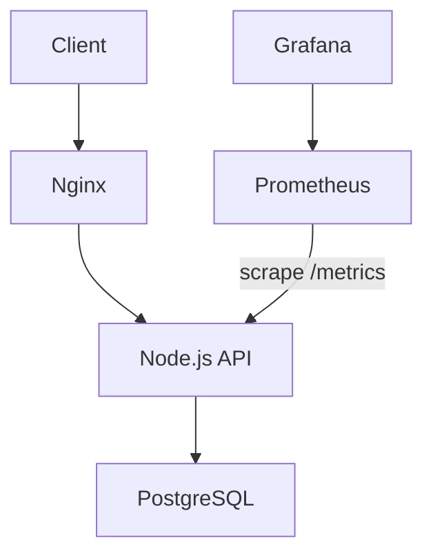

# CaseLab Maintenance Service

Production-like учебный сервис на Node.js для учёта оборудования и заявок на обслуживание. Проект объединяет authentication, RBAC, PostgreSQL, Docker Compose, Nginx, Prometheus, Grafana, OpenAPI, Jest и Postman/Newman.

## Cases

- **Case 1 — Weather CLI:** прогноз Open-Meteo для нескольких городов, JSON-отчёты и локальный кэш.
- **Case 2 — Maintenance REST API:** Express API для оборудования, заявок и погодных условий наружных работ.
- **Case 3 — PostgreSQL and analytics:** Sequelize models, migrations, transactions, assignees, status history и SQL-отчёты.
- **Case 4 — Production readiness:** authentication и sessions, RBAC, health/metrics, Docker/Nginx, Prometheus/Grafana, OpenAPI, Jest, Postman и operational runbook.

## Stack

- Node.js 20+, ESM, Express 5 и Zod;
- PostgreSQL 16, Sequelize 6 и sequelize-cli;
- JWT access tokens и opaque refresh sessions;
- Pino, Helmet, CORS и rate limiting;
- Docker Compose и Nginx;
- Prometheus и Grafana;
- OpenAPI 3.0.3 и Swagger UI;
- Jest, Supertest, Postman/Newman;
- ESLint и Prettier.

## Production-like Quick Start

Требуются Git, Docker Engine или Docker Desktop и Docker Compose.

```bash
git clone https://github.com/SmokyRM/caselab-js.git
cd caselab-js
cp .env.example .env
```

Задайте в `.env` как минимум:

```dotenv
DB_PASSWORD=<strong-random-password>
JWT_ACCESS_SECRET=<random-secret-at-least-32-characters>
GRAFANA_ADMIN_PASSWORD=<strong-random-password>
```

Запустите production-like stack:

```bash
docker compose -f docker-compose.prod.yml up --build -d
docker compose -f docker-compose.prod.yml ps
```

Migrations выполняются сервисом `migrate` до запуска API. Seed data не загружаются автоматически. Для demo/Postman окружения:

```bash
docker compose -f docker-compose.prod.yml --profile tools run --rm seed
```

Доступные URL:

| Resource     | URL                                           |
| ------------ | --------------------------------------------- |
| API          | `http://localhost:8080`                       |
| Health       | `http://localhost:8080/api/health`            |
| Readiness    | `http://localhost:8080/api/health/ready`      |
| Swagger UI   | `http://localhost:8080/api/docs/`             |
| OpenAPI JSON | `http://localhost:8080/api/docs/openapi.json` |
| Grafana      | `http://localhost:8080/grafana/`              |

Prometheus и `/metrics` доступны только внутри Compose network и намеренно заблокированы внешним Nginx.

Подробные инструкции:

- [Deployment guide](docs/DEPLOYMENT.md)
- [Operational runbook](docs/RUNBOOK.md)

## Architecture


```mermaid
flowchart TD
  Client --> Nginx
  Nginx --> API[Node.js API]
  API --> PostgreSQL
  Prometheus -->|scrape /metrics| API
  Grafana --> Prometheus
```

HTTP request проходит через routes, validation/auth middleware, controllers, services, repositories и PostgreSQL. Services содержат business rules и транзакции; repositories выполняют Sequelize queries и параметризованный raw SQL.

```text
database/               migrations and demo seeders
docs/postman/           Week 4 Postman collection and environment
docs/DEPLOYMENT.md      deployment procedure
docs/RUNBOOK.md         operational troubleshooting
monitoring/prometheus/  scrape config and alert rules
monitoring/grafana/     provisioned datasource and dashboard
nginx/                  reverse proxy configuration
src/docs/               OpenAPI document
src/                    application code
tests/                  unit and integration tests
docker-compose.yml      development PostgreSQL
docker-compose.test.yml isolated test PostgreSQL
docker-compose.prod.yml production-like stack
```

## Authentication and Sessions

| Method | Endpoint             | Purpose                           |
| ------ | -------------------- | --------------------------------- |
| POST   | `/api/auth/register` | Register a `viewer`               |
| POST   | `/api/auth/login`    | Login and create session          |
| POST   | `/api/auth/refresh`  | Rotate refresh session            |
| POST   | `/api/auth/logout`   | Revoke refresh session            |
| GET    | `/api/auth/me`       | Return current authenticated user |

Access token — short-lived Bearer JWT. Refresh token — opaque random value stored only as a hash in PostgreSQL and delivered through an HttpOnly cookie. Refresh performs rotation: the previous token is replaced. Passwords are stored only as scrypt hashes. Unknown email and wrong password return the same public error.

Production configuration requires a Secure refresh cookie. The current Compose stack does not terminate TLS, so a real deployment must add HTTPS before Nginx or terminate TLS in Nginx. Plain HTTP on localhost is only a local demo and is not a complete secure production deployment.

## RBAC

| Action                             | viewer | technician                         | admin |
| ---------------------------------- | :----: | ---------------------------------- | :---: |
| Read equipment and requests        |   ✓    | ✓                                  |   ✓   |
| Read analytics and weather         |   ✓    | ✓                                  |   ✓   |
| Create or update request           |   —    | ✓                                  |   ✓   |
| Change request status              |   —    | Only when assigned to that request |   ✓   |
| Create, update or delete equipment |   —    | —                                  |   ✓   |
| Replace or remove assignees        |   —    | —                                  |   ✓   |
| Delete request                     |   —    | —                                  |   ✓   |

Authorization happens after authentication. Admin status changes still obey domain transition and assignee rules.

## Request Business Rules

Allowed transitions:

- `new → in_progress`;
- `new → rejected`;
- `in_progress → done`;
- `in_progress → rejected`.

`done` and `rejected` are terminal. Starting work requires at least one assignee; otherwise the API returns `409 REQUEST_REQUIRES_ASSIGNEES`. A technician may change status only for an assigned request; otherwise it returns `403 FORBIDDEN`.

Team replacement requires at least one technician and exactly one `lead`. A duplicate or unknown technician is rejected. A lead cannot be removed while members remain.

Status change is transactional:

```text
BEGIN → SELECT request FOR UPDATE → validate authorization and transition
      → update request → insert status history → COMMIT
```

Team replacement also locks the request row and replaces all assignments in one transaction. Failures roll back the complete operation.

## API

All business endpoints use `/api` and require Bearer authentication unless stated otherwise.

### Equipment

| Method | Endpoint                      | Access        |
| ------ | ----------------------------- | ------------- |
| GET    | `/api/equipment`              | authenticated |
| POST   | `/api/equipment`              | admin         |
| GET    | `/api/equipment/:id`          | authenticated |
| PATCH  | `/api/equipment/:id`          | admin         |
| DELETE | `/api/equipment/:id`          | admin         |
| GET    | `/api/equipment/:id/requests` | authenticated |
| GET    | `/api/equipment/:id/weather`  | authenticated |

### Maintenance Requests

| Method | Endpoint                              | Access            |
| ------ | ------------------------------------- | ----------------- |
| GET    | `/api/requests`                       | authenticated     |
| POST   | `/api/requests`                       | technician, admin |
| GET    | `/api/requests/:id`                   | authenticated     |
| PATCH  | `/api/requests/:id`                   | technician, admin |
| PATCH  | `/api/requests/:id/status`            | technician, admin |
| DELETE | `/api/requests/:id`                   | admin             |
| GET    | `/api/requests/:id/history`           | authenticated     |
| POST   | `/api/requests/:id/assignees`         | admin             |
| DELETE | `/api/requests/:id/assignees/:userId` | admin             |

### Analytics

- `GET /api/sites/:id/summary` — site metadata and request aggregates;
- `GET /api/reports/equipment-load` — equipment load, request counts, planned hours and maintenance timestamps.

Filtering, sorting and pagination are performed in PostgreSQL. Analytics raw SQL uses CTE, `GROUP BY`, `HAVING` and bind parameters; user input is not concatenated into SQL.

### Error Contract

```json
{
  "error": {
    "code": "VALIDATION_ERROR",
    "message": "Переданы некорректные данные.",
    "details": [],
    "requestId": "uuid"
  }
}
```

The `requestId` is also written to structured API logs and is the primary correlation key.

## Database

The schema is managed only by migrations; `sequelize.sync()` is not used. Main relations:

- Site → Equipment: 1:N;
- Equipment → EquipmentPassport: 1:1;
- Equipment → MaintenanceRequest: 1:N;
- MaintenanceRequest → RequestStatusHistory: 1:N;
- MaintenanceRequest ↔ Technician: N:M through RequestAssignee;
- User → AuthSession: 1:N;
- Technician → User: optional 1:1.

The schema follows 3NF: sites, passports, technicians, users, sessions and history are separate entities; relation attributes `role` and `hours` belong to the join table.

Important delete rules include Site → Equipment `RESTRICT`, Equipment → Passport `CASCADE`, Equipment → Request `RESTRICT`, Request → Assignees/History `CASCADE`, User → AuthSession `CASCADE`, and Technician → User `RESTRICT`.

Common development commands:

```bash
npm run db:up
npm run db:migrate
npm run db:seed
npm run db:migrate:undo
npm run db:migrate:undo:all
npm run db:seed:undo:all
npm run db:down
```

Seeds are demo data and are not idempotent. They include five technicians plus demo `technician` and `admin` users for Postman. Demo credentials are documented in the Postman environment and are not production account provisioning.

## Health and Monitoring

| Endpoint            | Meaning                  |
| ------------------- | ------------------------ |
| `/api/health`       | Basic HTTP health        |
| `/api/health/live`  | Node.js process liveness |
| `/api/health/ready` | PostgreSQL readiness     |

When PostgreSQL is unavailable, liveness remains `200`, readiness becomes `503`, and `service_ready` becomes `0`.

Prometheus scrapes internal `/metrics`. Grafana is available at `http://localhost:8080/grafana/` and provisions dashboard **CaseLab Service Overview** (`caselab-week4-overview`). Panels include request rate, error share, P95 latency, readiness, application errors, status/priority counts, close time, overdue requests, equipment load and planned hours.

Alert `ServiceNotReady` fires when `service_ready == 0` for one minute with severity `warning`. Alertmanager is not configured.

## OpenAPI and Swagger

- Swagger UI: `http://localhost:8080/api/docs/`
- Raw specification: `http://localhost:8080/api/docs/openapi.json`
- Validation: `npm run openapi:validate`

Swagger UI is public and supports Bearer authorization. OpenAPI documents auth, RBAC, business errors, health, CRUD and analytics. The specification is maintained manually and must remain synchronized with Express routes.

## Tests

The isolated test database is `caselab_test` on host port `5433`.

```bash
npm run test:db:up
npm test
npm run test:coverage
npm run test:db:down
```

Unit tests cover business rules and RBAC. Integration tests cover authentication, CRUD, status transactions and documentation endpoints.

Current verified coverage snapshot:

| Metric     | Coverage |
| ---------- | -------: |
| Statements |   71.42% |
| Branches   |   63.94% |
| Functions  |   69.81% |
| Lines      |   73.28% |

## Postman and Newman

- Collection: `docs/postman/CaseLab Maintenance API.postman_collection.json`
- Environment: `docs/postman/CaseLab Maintenance API.postman_environment.json`
- Base URL: `http://localhost:8080`

Start and seed the production-like stack, then run:

```bash
npm run test:postman
```

The collection verifies register/login/refresh/logout, Bearer auth, viewer/technician/admin RBAC, equipment and request CRUD, assignees, status rules, history, health, docs and analytics. The refresh token stays in the Postman cookie jar and is never copied into an environment variable. External weather is skipped by default; set `runExternalWeather=true` to test Open-Meteo explicitly.

## Environment

`.env` is ignored. `.env.example` contains local examples and placeholders.

| Variable                                                              | Purpose                         |
| --------------------------------------------------------------------- | ------------------------------- |
| `PORT`, `NODE_ENV`                                                    | API runtime                     |
| `DB_HOST`, `DB_PORT`, `DB_NAME`, `DB_USER`, `DB_PASSWORD`             | PostgreSQL connection           |
| `DB_POOL_MAX`, `DB_POOL_MIN`, `DB_POOL_ACQUIRE_MS`, `DB_POOL_IDLE_MS` | Sequelize pool                  |
| `JWT_ACCESS_SECRET`, `JWT_ACCESS_TTL_SECONDS`                         | Access JWT signing and TTL      |
| `REFRESH_TOKEN_TTL_SECONDS`                                           | Refresh session TTL             |
| `AUTH_COOKIE_SECURE`, `AUTH_COOKIE_SAME_SITE`, `AUTH_COOKIE_NAME`     | Refresh cookie                  |
| `AUTH_LOGIN_RATE_LIMIT_WINDOW_MS`, `AUTH_LOGIN_RATE_LIMIT_MAX`        | Login limiter                   |
| `RATE_LIMIT_WINDOW_MS`, `RATE_LIMIT_MAX`                              | General API limiter             |
| `CORS_ORIGINS`, `TRUST_PROXY`, `LOG_LEVEL`                            | HTTP and logging                |
| `GEOCODING_API_URL`, `FORECAST_API_URL`, `REQUEST_TIMEOUT_MS`         | Open-Meteo client               |
| `TEMPERATURE_UNIT`, `PRECIPITATION_UNIT`                              | Weather units                   |
| `OUTDOOR_MAX_PRECIPITATION`, `OUTDOOR_MAX_WIND_SPEED`                 | Outdoor-work rules              |
| `REPORTS_DIR`                                                         | Weather CLI reports/cache       |
| `GRAFANA_ADMIN_USER`, `GRAFANA_ADMIN_PASSWORD`, `GRAFANA_ROOT_URL`    | Grafana                         |
| `NGINX_PORT`                                                          | Host Nginx port, default `8080` |

## Security

- scrypt password hashing;
- generic invalid-login responses;
- short-lived JWT access token;
- opaque rotating refresh token stored as a hash;
- HttpOnly/Secure cookie configuration;
- Helmet and explicit CORS allowlist;
- general and login-specific rate limits;
- 100 KB JSON body limit;
- non-root production API container;
- API, PostgreSQL, Prometheus and Grafana are not host-published.

The project does not claim TLS termination, CSRF tokens or Docker Secrets.

## Known Limitations

- the current Compose stack does not terminate TLS;
- Alertmanager is not configured;
- container images use pinned tags rather than immutable digests;
- OpenAPI is synchronized with Express routes manually;
- the provisioned Grafana dashboard is read-only;
- weather depends on external Open-Meteo availability;
- demo seeders are not idempotent;
- no zero-downtime deployment is provided;
- automated database backup/restore is outside the current project scope.

## Useful Commands

| Command                                          | Purpose                                |
| ------------------------------------------------ | -------------------------------------- |
| `npm start`                                      | Start API from host environment        |
| `npm run weather -- --city Москва --days 3`      | Run Case 1 CLI                         |
| `npm run openapi:validate`                       | Validate OpenAPI document              |
| `npm run test:postman`                           | Run production-like Postman collection |
| `npm run test:db:up`                             | Start isolated test PostgreSQL         |
| `npm test`                                       | Run unit and integration suites        |
| `npm run test:coverage`                          | Run coverage                           |
| `npm run test:db:down`                           | Remove isolated test database          |
| `npm run lint`                                   | Run ESLint                             |
| `npm run format:check`                           | Check formatting                       |
| `docker compose -f docker-compose.prod.yml down` | Stop stack and retain volumes          |
